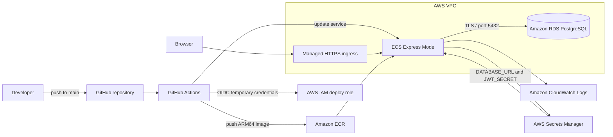

# sameSky

[](https://github.com/albertcastillom/moodTracker/actions/workflows/deploy.yml)

> A private daily check-in with a glimpse of how your community is feeling.

sameSky is a production-deployed full-stack wellness application for tracking moods, private journal entries, and daily habits. It also presents anonymous city-level mood trends without exposing individual entries.

Project live at [https://samesky.dev](https://samesky.dev)

## Features

- Email and password authentication with signed JWTs in HTTP-only cookies
- One mood check-in per user per day
- Anonymous city- and region-level mood aggregation
- Private journal entries
- Reusable habits with daily completion tracking
- Responsive React interface served by the Express application in production
- PostgreSQL schema management with Prisma migrations
- Containerized local and production environments
- Automated AWS deployment from the `main` branch

## Architecture



The application runs as a single ARM64 container on ECS Express Mode. AWS manages the Fargate capacity, HTTPS ingress, Application Load Balancer, health checks, and canary deployments. RDS is isolated in private subnets and accepts PostgreSQL traffic only from the application security group.

## AWS services

| Service                                | Purpose                                                                        |
| -------------------------------------- | ------------------------------------------------------------------------------ |
| Amazon ECS Express Mode                | Runs the container on managed Fargate capacity and performs canary deployments |
| Amazon ECR                             | Stores versioned ARM64 container images                                        |
| Amazon RDS for PostgreSQL              | Provides the managed production database, backups, and storage                 |
| AWS Secrets Manager                    | Stores the database connection string and JWT signing secret                   |
| Amazon VPC                             | Separates public application networking from private database networking       |
| Elastic Load Balancing                 | Routes HTTPS traffic and checks `/api/health`                                  |
| Amazon CloudWatch                      | Collects application logs and deployment alarms                                |
| AWS IAM                                | Enforces least-privilege runtime and deployment access                         |
| AWS Budgets and Cost Anomaly Detection | Provides spend thresholds and unexpected-cost alerts                           |

## Technology stack

| Layer          | Technology                                          |
| -------------- | --------------------------------------------------- |
| Frontend       | React 19, Vite 8, CSS                               |
| Backend        | Node.js 22, Express 5                               |
| Authentication | bcrypt, JWT, HTTP-only cookies                      |
| Database       | PostgreSQL 16, Prisma 7                             |
| Containers     | Docker, Docker Compose, multi-stage builds          |
| Cloud          | AWS ECS, ECR, RDS, Secrets Manager, VPC, CloudWatch |
| CI/CD          | GitHub Actions, GitHub OIDC, Docker Buildx          |

## Local development with Docker

Docker Compose runs the application and PostgreSQL using the same major runtime versions used in production.

### Prerequisites

- Docker Desktop with Docker Compose
- Git

### Start the application

```sh
docker compose build app
docker compose up -d db
docker compose run --rm app npm run db:migrate
docker compose up -d app
```

Open [http://localhost:3001](http://localhost:3001). Verify the API with:

```sh
curl http://localhost:3001/api/health
```

View container status and logs:

```sh
docker compose ps
docker compose logs -f app
```

Stop the containers while retaining the PostgreSQL volume:

```sh
docker compose down
```

Use `docker compose down -v` only when you intentionally want to delete the local database volume.

## Local development without Docker

### Prerequisites

- Node.js 22
- PostgreSQL 16

Install dependencies and create the local environment file:

```sh
npm ci
cp .env.example .env
```

Set `DATABASE_URL` and `JWT_SECRET` in `.env`, then apply the development migrations and start both servers:

```sh
npm run db:dev
npm run dev
```

The Express API runs at [http://localhost:3000](http://localhost:3000), and the Vite development server runs at [http://localhost:5173](http://localhost:5173).

## Environment variables

| Variable        | Required          | Description                                                    |
| --------------- | ----------------- | -------------------------------------------------------------- |
| `DATABASE_URL`  | Yes               | PostgreSQL connection string used by Prisma                    |
| `JWT_SECRET`    | Yes in production | Secret used to sign and verify authentication tokens           |
| `NODE_ENV`      | Yes in production | Enables static frontend serving and production cookie settings |
| `CLIENT_ORIGIN` | Development only  | Allowed Vite origin; defaults to `http://localhost:5173`       |
| `PORT`          | No                | Express port; defaults to `3000`                               |

Production values are injected from AWS Secrets Manager when an ECS task starts. They are never stored in the image or GitHub repository.

## CI/CD pipeline

The workflow in [`.github/workflows/deploy.yml`](.github/workflows/deploy.yml) runs for every push to `main` and can also be started manually.

1. Install dependencies and run the application verification command.
2. Request short-lived AWS credentials through GitHub OIDC.
3. Build the production image for `linux/arm64`.
4. Push immutable `v-<commit-sha>` and moving `latest` tags to ECR.
5. Update the ECS Express service while preserving its runtime secrets and configuration.
6. Monitor the canary deployment and automatic rollback alarms.
7. Request `/api/health` from the production endpoint.

The workflow requires these GitHub repository variables:

- `AWS_REGION`
- `AWS_ROLE_ARN`
- `ECR_REPOSITORY`
- `ECS_SERVICE_ARN`

No long-lived AWS access keys are stored in GitHub. The IAM trust policy permits only this repository's `main` branch to assume the deployment role, and the role can push only to the project ECR repository and update only the project ECS service.

## Production deployment details

- Region: `us-west-2`
- Runtime architecture: ARM64
- Container port: `3000`
- Health endpoint: `/api/health`
- Database: PostgreSQL 16 on Amazon RDS
- Database connectivity: TLS using the Amazon RDS regional CA bundle
- Database migrations: `prisma migrate deploy` before application startup
- Deployment strategy: ECS-managed canary deployment with health monitoring and rollback alarms
- Scaling guardrail: one task minimum and maximum to control portfolio-project costs

## Security and cost controls

- Root-account MFA and no root access keys
- Separate IAM identities and roles for administration, ECS execution, and GitHub deployment
- GitHub OIDC credentials expire automatically after each workflow run
- RDS has no public endpoint and is reachable only from the application security group
- Secrets remain in Secrets Manager and are injected at task startup
- HTTP-only production cookies reduce client-side token exposure
- CloudWatch log groups use finite retention
- ECR lifecycle rules remove old versioned and untagged images
- AWS Budget and forecast alerts provide early spend warnings
- Cost Anomaly Detection monitors unexpected service charges
- Project and environment tags support cost allocation

## Available scripts

| Command              | Description                                  |
| -------------------- | -------------------------------------------- |
| `npm run dev`        | Run the Vite and Express development servers |
| `npm run build`      | Build the production frontend                |
| `npm start`          | Start the Express production server          |
| `npm test`           | Run the current build verification           |
| `npm run db:dev`     | Create and apply a development migration     |
| `npm run db:migrate` | Apply committed migrations in production     |
| `npm run db:seed`    | Seed the database with development data      |

## Planned improvements

- Manage AWS resources with Terraform or AWS CDK
- Add broader API and component test coverage
- Use a restricted PostgreSQL application role instead of the RDS master user
- Add application-specific CloudWatch latency and error alarms
- Add a custom domain and DNS configuration
- Exercise database restore and deployment rollback procedures
